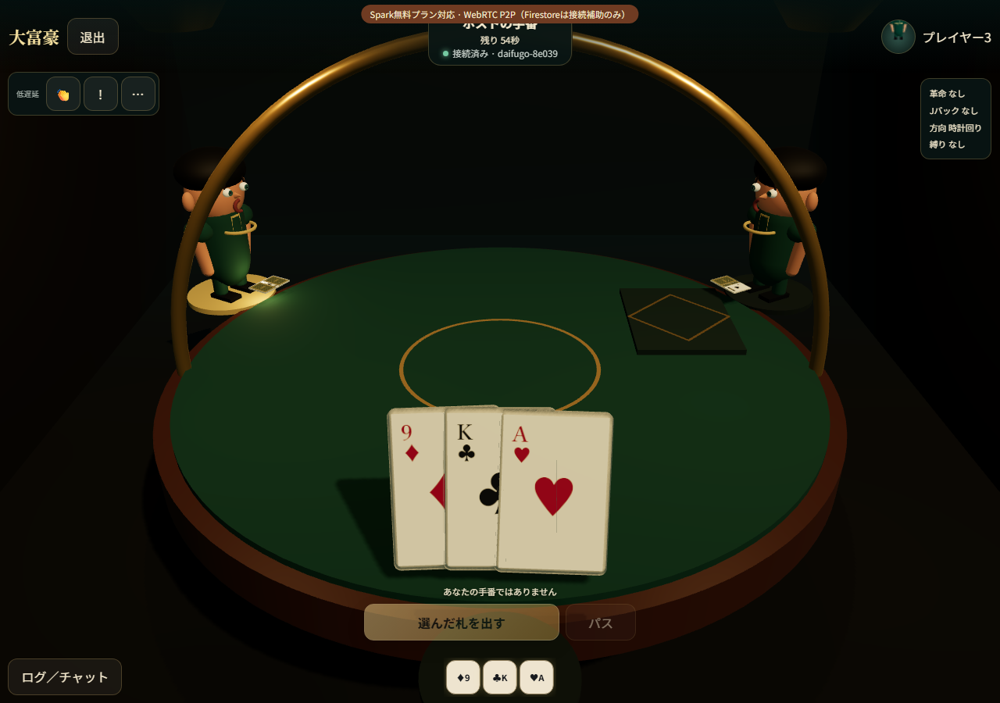
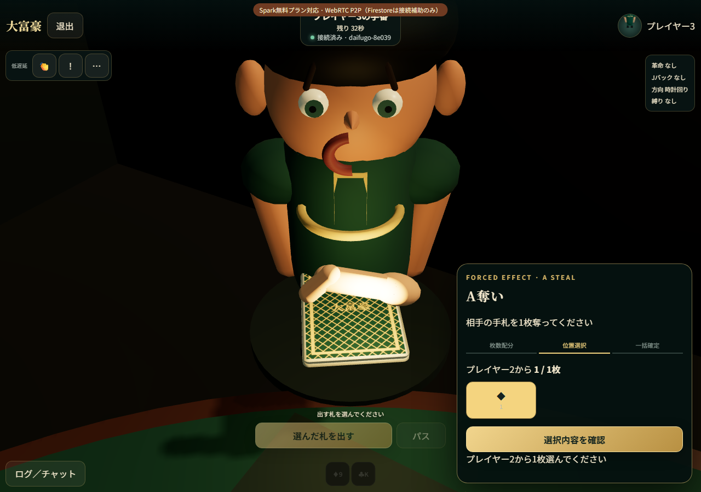
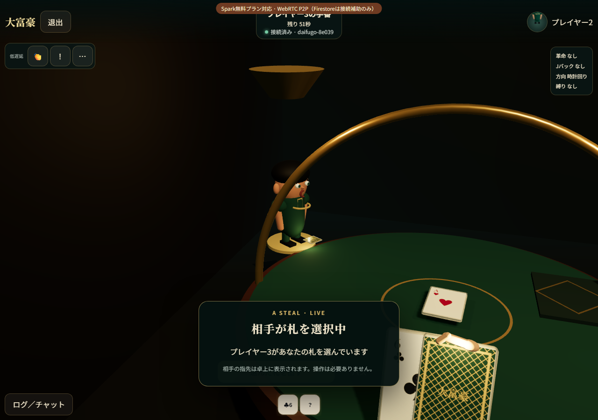

# Visual gameplay proof — 2026-08-20

This evidence was captured from the real React/Three.js canvas in Chromium at 1280×900. The
semantic multi-client flow uses the same viewer projections and command boundary as the existing
authoritative E2E match. Visual-only contexts explicitly keep WebGL enabled.

## What was visually inspected

- Normal player view: the viewer's seat is rotated to the near side, the viewer avatar no longer
  blocks the hand, and cards are sorted weak-to-strong. Every card to the right has a larger depth
  and render order, so it is drawn in front of the card to its left.
- A-steal actor view: after count allocation, the camera moves inside the table and faces the victim.
  The victim's selectable cards are face-down and the remote pointer hand moves over the selected
  slot.
- A-steal victim view: the victim keeps their own hand/table view, looks toward the actor, and sees
  the actor's last pointer position without receiving hidden card faces.
- The first visual capture reproduced a blank/black 3D scene because the old multi-context harness
  intentionally hid every canvas. A dedicated one-canvas visual scenario was added so a DOM-only
  pass can no longer be presented as visual proof.

## Captures

## Final automated results

- Web typecheck: pass
- ESLint: pass with zero warnings
- Vitest: 16 files, 72 tests passed
- Production/PWA build: pass, 16 precache entries
- Playwright full run: 15 passed, 9 intentional project skips, 0 failed (2.2 minutes)
- Visual gameplay scenarios: actor and victim views both passed with real WebGL enabled

The intentional skips avoid running desktop-only multi-context authority scenarios a second time in
the mobile project. Pixel 7 still runs its dedicated create/deal/opening-play gameplay test and three
3D/accessibility smoke tests.
